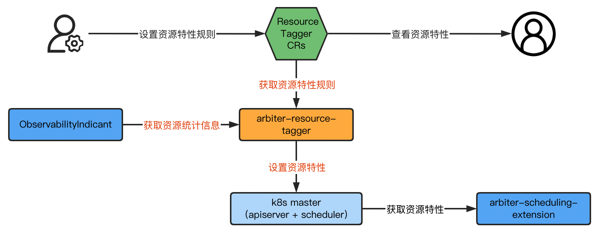
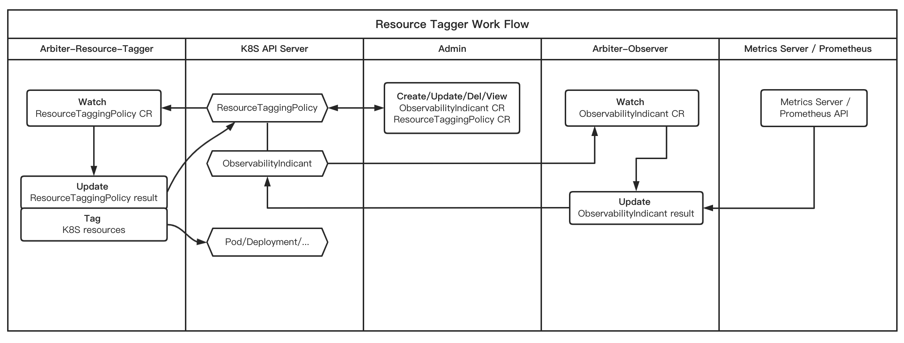

Executors define behaviors based on OBI metrics to allow users to quickly scale and automate desired operations.

1. Resource Tagger(Update Resource)
2. Power off node

### Executor Function And Value
1. Through automatic detection and marking of resources running in the K8S cluster, users can have a more intuitive understanding of the characteristics of resources.
2. Based on these marked characteristics, the scheduler can make scheduling optimisation recommendations to schedule resources to more suitable nodes for operation.
3. By default, CPU-sensitive and memory-sensitive resource characteristics are detected and marked, but users can customize the resource characteristics and detection criteria according to their business requirements.

### Executor Architecture

### Executor Workflow

`executor-resource-tagger` and `observer` do not interact through API calls, but data-driven interaction through data update and acquisition of ObservabilityIndicant CR.

### Data Driven Model Diagram

### Resource Tagger Demo
[executor update resource](../User%20Cases/update-resource.md)
