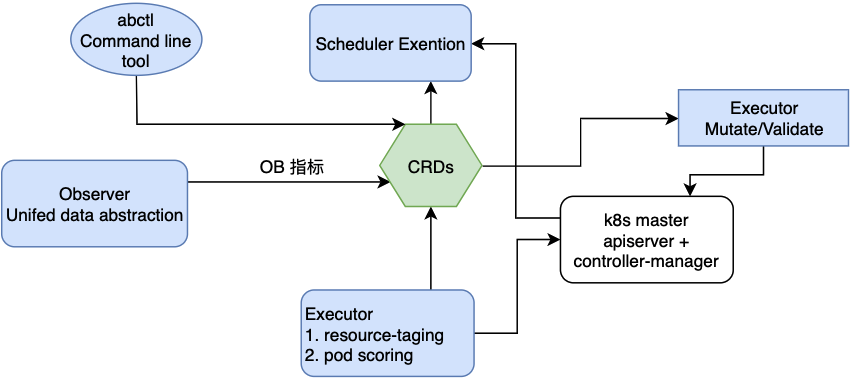

这里对 Arbiter 的整体技术架构进行介绍。

## Components
Basically, it consists of 4 components by now, observer, scheduler, executor and a command line tool called 'abctl'.

### Observer
Observer is used to collect various data(metric/log/trace), generate the OBI object, and stored as CRDs inside Kubernetes.

Refer to the [Observer](./observer.md) for details.

### Scheduler Extension
Scheduler is an alternative scheduler built on top of Kubernetes default scheduler. It contains the default scheduler of Kubernetes and provide a extension point for Arbiter to extend.

For each Arbiter scheduler extension, it'll provide a context for pod scheduling, and can refer to the OBI object above. So it'll have both static and runtime data, including pod, node, metric/log/tracing from OBI, and allow user to write scheduing logic using javascript on their purpose.

Refer to the [Scheduler Extension](./scheduler-extension.md) for details.

### Executor
Executor is the action trigger if any rule is satisfied. Let user to invoke other service or write custom controller based on events from executor.

Refer to the [Executor](./executor.md) for details.

### abctl tool
A tool to let developer or administrator to view resource data from Arbiter more easy, and can also integrate this tool to do automatic tasks from custom scripts.

## Communication between components
Here is the relationship between the components above.

