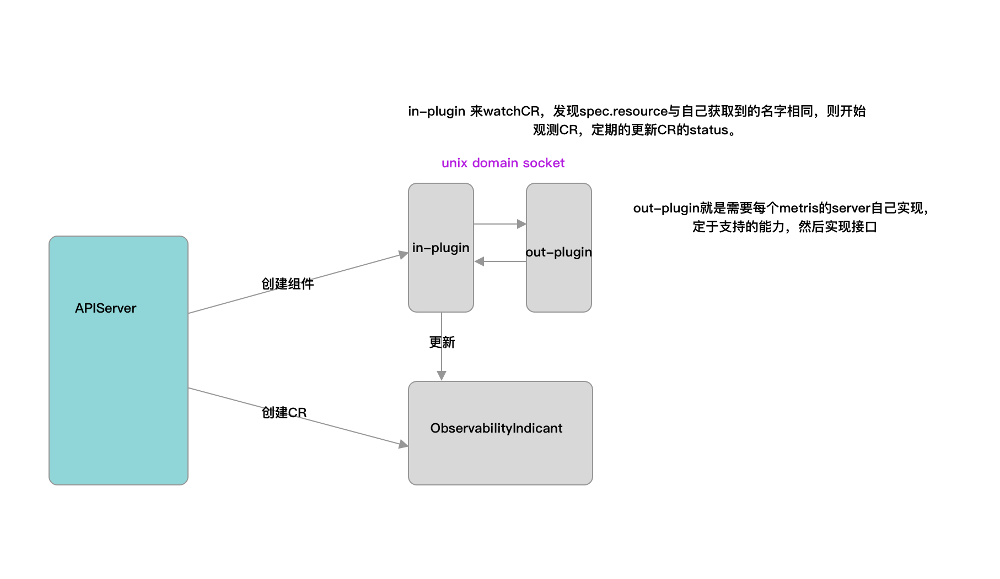

<!--
`arbiter-observer` is mainly used to collect metrics-server, prometheus and other related data to provide unified resource access for the scheduler.
Provides a data source for the scheduler. And follow-up as a unified monitoring data panel to provide data visualization support capabilities.
-->
`arbiter-observer` 主要就是用来收集 metrics-server, prometheus 等相关的数据为调度器提供统一资源接入，
为调度器提供数据源。以及后续作为统一监控数据面板，提供数据可视化支持能力。

<!--
## Design

`arbiter-observer` is mainly implemented in the form of `operator`. Periodically obtain monitoring data and fill in the status field.
The data acquisition form supports metric-server and prometheus in the first version.
Data sources such as metric-server and prometheus are deployed with arbiter-server through sidecar. The two communicate via `rpc` and `socket`.
-->
## 设计形式

`arbiter-observer` 主要实现为 `operator` 的形式。周期性获取监控数据填写到 status 字段中。
数据的获取形式，在第一个版本中支持到 metric-server，prometheus。
metric-server，prometheus 这类的数据源与 arbiter-server 通过 sidecar 方式部署。二者通过 `rpc`  和 `socket` 通信。  

<!--

`arbiter-observer` selects target resources by resource name, or labels. At present, `ObservabilityIndicant` does not process a group of data, so you need to combine the index when using the labels. For the data obtained through the labels, sort the data by name, and select index. If the subscript exceeds the length of the resource list, no data acquisition coroutine will be started.
-->
`arbiter-observer` 通过资源的名字，或者标签来选择目标资源。目前 `ObservabilityIndicant` 没有对一组的数据进行处理，
所以在使用标签的时候需要结合 index, 对于通过标签获取到的数据按照名称排序，选择 index。
如果下标超过资源列表长度，不会启动任何获取数据协程。

<!--
Currently you can set template query statements in spec, such as PromQL `sum(node_memory_MemTotal_bytes{instance="{{.metadata.name}}"} - node_memory_MemAvailable_bytes{instance="{{.metadata.name}}"})`. When executed, the information of the actual resource will be filled into the query statement.
-->
目前可以在 spec 中设置模板查询语句，例如 PromQL `sum(node_memory_MemTotal_bytes{instance="{{.metadata.name}}"} - node_memory_MemAvailable_bytes{instance="{{.metadata.name}}"})`。
在执行的时候，会将实际资源的信息填入到查询语句中。

<!-- **Architecture diagram** -->
**整体架构如图**


<!-- **Timing diagram** -->
**时序图**


<!-- ## GRPC Data Format Definition -->
## GRPC 数据定义
```grpc
service Server {
    rpc GetPluginName (GetPluginNameRequest)
        returns (GetPluginNameResponse) {}
    
    rpc PluginCapabilities (PluginCapabilitiesRequest)
        returns (PluginCapabilitiesResponse) {}

    rpc GetMetrics (GetMetricsRequest)
        returns (GetMetricsResponse) {}
}
```
<!--
There are three interfaces are defined, `GetPluginName` gets the name of the data source, `arbiter-observer` judges by combining this name with `spec.source` of `ObservabilityIndicant`,

Whether the currently occurring event needs to be handled. `PluginCapabilitiyes` tells what aggregation logic is supported by the current data source, such as getting max, min, etc.

The last function `GetMetrics` is used to get monitoring data.
-->
共定义三个接口，`GetPluginName` 获取数据源的名称，`arbiter-observer` 通过这个名称与 `ObservabilityIndicant` 的 `spec.source` 结合判断，
是否需要处理当前发生的事件。 `PluginCapabilitiyes` 告诉当前数据源支持哪些聚合逻辑，例如获取最大值，最小值等。 
最后一个函数 `GetMetrics` 就是用来获取监控数据。  

<!-- ## CRD Definition -->
## CRD 定义

[observer-crd](https://github.com/kube-arbiter/arbiter/blob/main/manifests/crds/arbiter.k8s.com.cn_observabilityindicants.yaml)

<!--
## Field meaning
1. source field  
`source` judges whether the change of `ObservabilityIndicant` needs to be processed by comparing it with the data obtained by the `GetPluginName` interface.
-->
## 字段含义
1. source 字段  
`source` 通过与 `GetPluginName` 接口获取到的数据对比判断是否需要处理 `ObservabilityIndicant` 的变化。

<!--
2. metric field  
`metric.historyLimit` This field indicates how many pieces of periodically acquired data are retained, such as historyLimit=3, after the third acquisition of data, the data is `[1, 2, 3]`, Then the data retained after the fourth acquisition is `[2, 3, 4]`. Currently this field is fixed to 1
`metric.metricIntervalSeconds` represents the interval for fetching data.
`metric.timeRangeSeconds` represents the time range of the acquired data, `now-timeRangeSeconds, now`.
-->
2. metric 字段  
`metric.historyLimit` 这个字段表示保留多少条周期性获取的数据，例如 historyLimit=3， 在第三次获取数据后，数据为`[1, 2, 3]`, 
那么第四次获取数据后保留的数据为 `[2, 3, 4]`。  
`metric.metricIntervalSeconds` 表示获取数据的周期。    
`metric.timeRangeSeconds` 表示获取的数据的时间范围，`now-timeRangeSeconds, now`。  

<!--`targetRef` is used to identify a specific resource associated with an `ObservabilityIndicant`, such as a Pod, or a Node.
-->
3. targetRef 字段  
`targetRef` 用来确定一个 `ObservabilityIndicant` 关联的具体资源，例如 Pod，或者 Node。

    ```yaml
    targetRef:
      group: ""
      index: 1
      kind: Node
      labels:
        beta.kubernetes.io/arch: amd64
      name: ""
      namespace: ""
      version: v1
    ```

使用 `group`, `kind`, `version` 来确定具体资源的类型以及版本，使用 `name` 或者 `labels+index`来确定具体的资源。
获取到资源后，即可利用该资源填充查询语句。

<!-- ### Observer Plugin Design -->
## Observer Plugin 设计
[Observer Plugin](./observer-plugin.md)